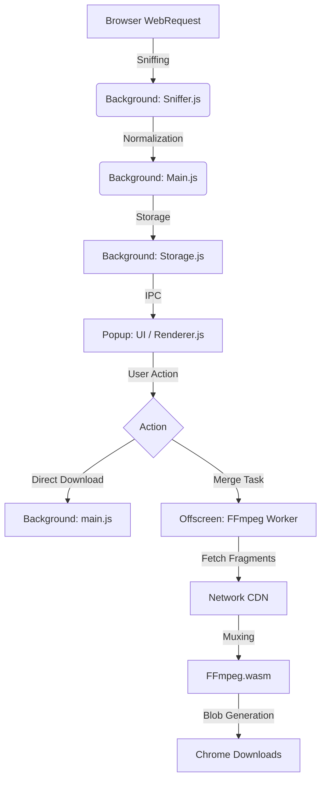

# Media Sniffer Vibe 项目架构与功能概览

> [!NOTE]
> 本文档旨在为 Claude Code 或其他开发者提供项目的全景架构图，协助进行深度的代码重构与逻辑优化。

## 1. 核心架构图 (Architecture Data Flow)

## 2. 目录结构与职责说明

| 路径 `extension/` | 核心职责 | 关键技术 |
| :--- | :--- | :--- |
| `manifest.json` | 扩展入口、权限配置 (WebRequest, DNR, Offscreen) | MV3 |
| **`js/background/`** | **后台常驻逻辑 (Service Worker)** | |
| ├─ `main.js` | 消息中心 & 网络拦截入口。协调 Storage 与 Offscreen。 | WebRequest API |
| ├─ `sniffer.js` | **核心引擎**。负责特征匹配、URL 归一化、媒体类型识别、音视频配对。 | Regex, Base64 |
| ├─ `storage.js` | 内存状态管理。存储每个 Tab 发现的媒体列表、合并状态。 | Map, Set |
| ├─ `parser.js` | HLS/DASH 清单解析（.m3u8 / .mpd）。 | URL Parser |
| **`js/offscreen/`** | **重度任务处理 (Offscreen Document)** | |
| ├─ `main.js` | 任务分配器。处理分段下载、代理下载和 FFmpeg 任务。 | Fetch, Stream |
| ├─ `ffmpeg.js` | FFmpeg.wasm 封装层。负责文件挂载、参数执行、内存清理。 | WebAssembly |
| **`js/popup/`** | **用户交互界面** | |
| ├─ `renderer.js` | 渲染媒体列表。根据当前状态（合并、分段、直链）显示对应按钮。 | UI Logic |
| ├─ `i18n.js` | 多语言支持。 | i18n API |
| `libs/` | 第三方依赖库。主要为 FFmpeg.core。 | WASM |

## 3. 核心功能点 (Functional Blocks)

### A. 智能嗅探引擎 (Sniffer Engine)
*   **特征匹配 (Signature Matching)**：通过 `MEDIA_SIGNATURES` 列表拦截常见的流媒体请求。
*   **URL 归一化 (URL Normalization)**：自动识别并剥离 `range`, `bytestart`, `rn` 等参数，将碎片请求合并为完整的资源记录。
*   **媒体识别 (Media Categorization)**：不依赖文件后缀，而是结合 URL、`itag`、`efg` 等特征区分 Video/Audio。
*   **音视频配对 (Track Pairing)**：通过 `groupTag` (cpn, logid, video_id) 将分离的音轨和视轨关联，触发合并按钮。

### B. 高性能合并 (High-Speed Merging)
*   **Companion Merge (配对合并)**：将独立的音轨和视轨下载到内存，使用 FFmpeg `-c copy` 无损封装（支持 MP4/MKV 自动回退）。
*   **Native Merge (切片合并)**：解析 HLS/DASH 清单，并发下载 TS/M4S 切片并在内存中二进制合并。
*   **Offscreen 负载均衡**：在独立文档中运行 WASM，不阻塞浏览器主线程和后台 Service Worker。

### C. 下载与反爬绕过
*   **DNR 规则动态注入**：下载时动态修改 `Referer` 和 `User-Agent`，绕过某些站点的防盗链。
*   **代理下载 (Proxy Download)**：对于有跨域限制或需要特殊 Header 的资源，通过扩展环境 fetch 后导出 Blob。

## 4. 当前技术债与重构方向 (Refactoring Directions)

> [!WARNING]
> 为了快速修复特定网站的问题，当前代码中存在一些硬编码的“补丁”逻辑。

1.  **硬编码检测**：`sniffer.js` 中存在针对特定域名（facebook, googlevideo, douyinvod）的 `if-else` 判断。
    *   *建议*：抽象为基于策略 (Strategy Pattern) 的配置系统，或者更通用的规则引擎。
2.  **UMP (POST) 协议支持**：YouTube 嵌入式视频现在大量使用 POST 碎片。
    *   *建议*：增加对 WebRequest Body 的拦截支持，或者模拟 POST 合并逻辑。
3.  **UI 状态同步**：Popup 与 Background 之间的状态同步目前基于消息轮询或重绘。
    *   *建议*：引入观察者模式或更现代的状态管理方案。
4.  **FFmpeg 参数灵活性**：目前的合并参数相对固定（`-c copy`）。
    *   *建议*：根据探测到的 Codec 自动生成最优 FFmpeg 指令。
